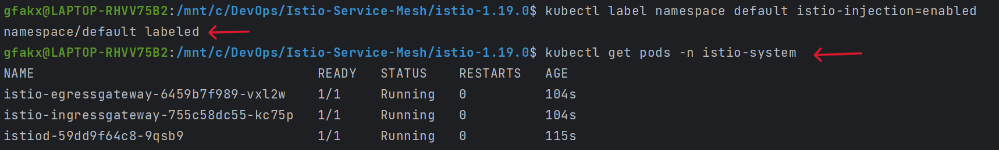

# Service Mesh with Istio on AWS EKS

## Overview
This project provides a detailed guide on setting up the Istio service mesh on an Amazon EKS cluster. By following this guide, you will learn how to deploy an EKS cluster using Terraform, install Istio, deploy a sample application, and utilize advanced Istio features for traffic management such as canary releases and fault injection. This project aims to equip you with hands-on experience and an understanding of how Istio can be used to enhance microservices deployments on Kubernetes.

## Table of Contents
- [Setting Up the EKS Cluster with Terraform](#1-setting-up-the-eks-cluster)
- [Istio Service Mesh Installation](#2-istio-service-mesh-installation)
- [Deploying the Sample Application](#3-deploying-the-sample-application)
- [Istio Traffic Management](#4-istio-traffic-management)
- [Monitoring with Istio Addons](#5-monitoring-with-istio-addons)
- [Cleanup: Tearing Down the Environment](#6-cleanup-tearing-down-the-environment)

---

## 1. Setting Up the EKS Cluster

### a. Infrastructure Configuration

- Prepare the EKS cluster using `Terraform`.
- Modify configurations in `main.tf` in the root directory.
  
**Terraform Commands**:
```
terraform init 
terraform fmt 
terraform validate
terraform plan
terraform apply
```


### b. Update Kubernetes Configuration

Use AWS EKS for the update.

```
aws eks update-kubeconfig --region us-east-1 --name eks_cluster 
kubectl get nodes  
kubectl get svc  
```


---

## 2. Istio Service Mesh Installation

**Objective**: Install Istio on EKS.

- **Retrieve Istio Package**:
  ```
  curl -L https://istio.io/downloadIstio | sh -
  ```
  
- **Access Istio Directory**:
  ```
  cd istio-1.19.0
  ```

- **Update System PATH**:
  ```
  export PATH=$PWD/bin:$PATH
  ```

- **Install Istio**:
  ```
  istioctl install --set profile=demo -y
  ```

- **Validate Installation**:
  ```
  kubectl get pods -n istio-system
  ```



---

## 3. Deploying the Sample Application

**Objective**: Launch "bookinfo" on EKS with Istio.

- **Activate Istio Sidecar**:
  ```
  kubectl label namespace default istio-injection=enabled
  ```

- **Deploy Bookinfo Application**:
  ```
  kubectl apply -f samples/bookinfo/platform/kube/bookinfo.yaml
  ```

- **Validate Deployment**:
  ```
  kubectl get services
  kubectl get pods
  ```

- **Expose the Application**:
  ```
  kubectl apply -f samples/bookinfo/networking/bookinfo-gateway.yaml
  ```

- **Access the Product Page**:
  ```
  export GATEWAY_URL=$(kubectl -n istio-system get service istio-ingressgateway -o jsonpath='{.status.loadBalancer.ingress[0].hostname}')
  echo "http://$GATEWAY_URL/productpage"
  ```


---

## 4. Istio Traffic Management

**Objective**: Control traffic flow in Bookinfo using Istio.

### Destination Rules

- **Apply Destination Rules**:
  ```
  kubectl apply -f samples/bookinfo/networking/destination-rule-all.yaml
  ```

- **Verify Destination Rules**:
  ```
  kubectl get destinationrules -o yaml
  ```
- **Route All Traffic to v1**:
  ```
  kubectl apply -f samples/bookinfo/networking/virtual-service-all-v1.yaml
  ```
- Now, when you access the Bookinfo application, you should always see the reviews without any stars, indicating the v1 version of the reviews service.
### Canary Releases

Gradually introduce a new service version using canary releases. For example, route 90% of traffic to `reviews:v1` and 10% to `reviews:v2`.
- Create a file with the below script`nano reviews-canary.yaml`
```  bash
  apiVersion: networking.istio.io/v1alpha3
kind: VirtualService
metadata:
  name: reviews
spec:
  hosts:
  - reviews
  http:
  - route:
    - destination:
        host: reviews
        subset: v1
      weight: 90
    - destination:
        host: reviews
        subset: v2
      weight: 10
  ```

- **Apply Canary Release Configuration**:
  ```
  kubectl apply -f reviews-canary.yaml
  ```
- Apply the above configuration and then access the Bookinfo application multiple times. Roughly 10% of the time, you should see black star ratings, indicating the v2 version of the reviews service.  

### Fault Injection

Test resilience with Istio's fault injection. Introduce a delay for the ratings service.
- Create a file with the below script`nano ratings-fault-injection.yaml`
```  bash
  apiVersion: networking.istio.io/v1alpha3
kind: VirtualService
metadata:
  name: ratings
spec:
  hosts:
  - ratings
  http:
  - fault:
      delay:
        percent: 100
        fixedDelay: 5s
    route:
    - destination:
        host: ratings
        subset: v1

  ```

- **Apply Fault Injection Configuration**:
  ```
  kubectl apply -f ratings-fault-injection.yaml
  ```

---

## 5. Monitoring with Istio Addons

**Objective**: Monitor your service mesh with Istio addons like Prometheus, Grafana, and Kiali.

- **Install Istio Addons**:
  ```
  kubectl apply -f samples/addons
  ```

- **Access Monitoring Dashboards**:
  ```
  istioctl dashboard kiali
  istioctl dashboard prometheus
  istioctl dashboard grafana
  ```

---


## 6. Cleanup: Tearing Down the Environment

- **Remove Bookinfo Application**:
  ```
  kubectl delete -f samples/addons
  ```

- **Uninstall Istio**:
  ```
  istioctl uninstall -y --purge
  kubectl delete namespace istio-system
  kubectl label namespace default istio-injection-
  ```

- **Delete Cluster Using Terraform**:
  ```
  terraform delete --auto-approve
  ```

---

This project has equipped you with the knowledge and practical experience of deploying and managing microservices in a Kubernetes environment using Istio. Each milestone is designed to build upon the previous one, providing a comprehensive understanding of each step. By following this guide, you can replicate our process and further explore the capabilities of Istio in a Kubernetes environment.